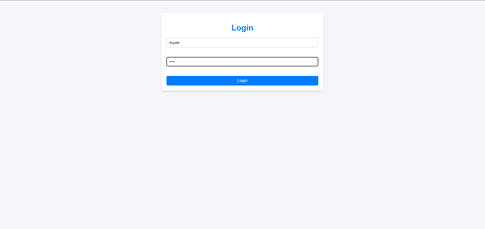
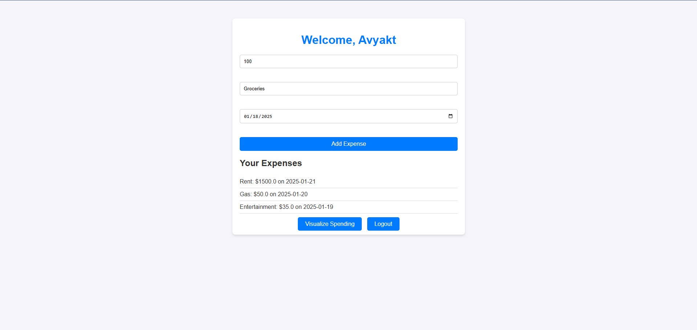
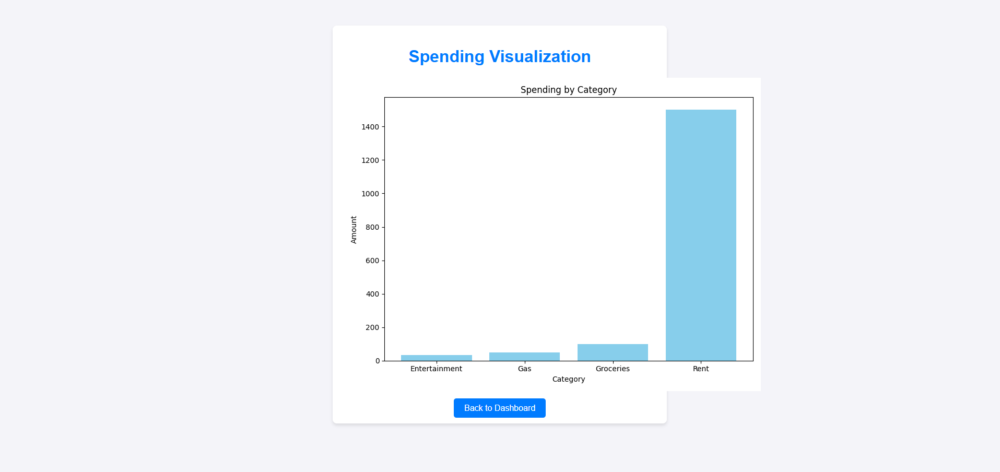

# Personal Expense Tracker with Visual Analytics

A Flask-based web application for tracking and visualizing personal expenses. Users can securely register, log in, manage their expenses, and gain visual insights through dynamic bar and pie charts.

---

## Features

- **User Authentication**: Secure registration and login system to manage personal accounts.
- **Expense Management**: Add, update, and delete expenses categorized by type (e.g., Groceries, Rent, Entertainment).
- **Data Visualization**: Generate bar and pie charts using Matplotlib to analyze spending patterns visually.
- **Responsive Design**: A user-friendly interface styled with HTML, CSS, and JavaScript for a seamless experience.

---

## Technologies Used

- **Languages**: Python, JavaScript, HTML, CSS
- **Frameworks & Libraries**: Flask, Matplotlib, SQLite
- **Tools**: Git, Python-dotenv
- **Database**: SQLite (local data storage)
- **Frontend Enhancements**: Custom CSS and JavaScript for dynamic behaviors

---

## Screenshots

### Login Page


### Dashboard


### Visualization


## Installation Instructions

### Prerequisites

Ensure you have the following installed:
- **Python** (3.10 or higher)
- **Git**

### Steps to Set Up Locally

1. **Clone the Repository**:
   ```bash
   git clone https://github.com/avyaktrout/personal-expense-tracker.git
